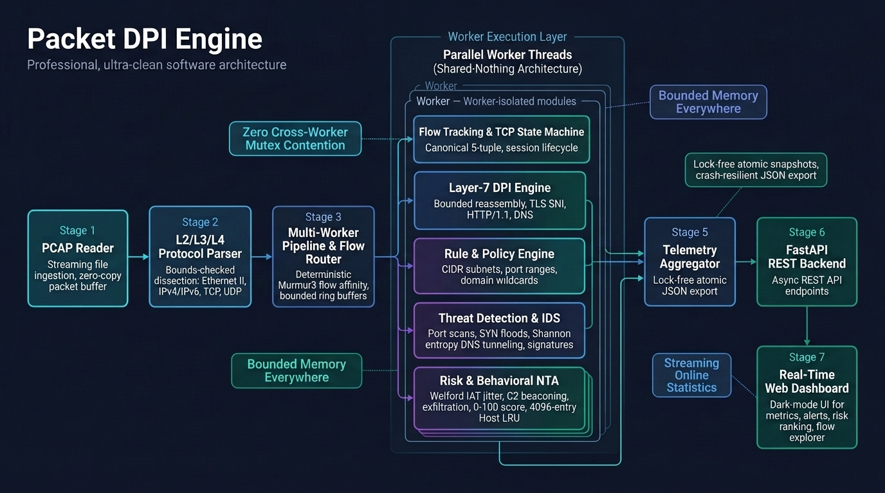
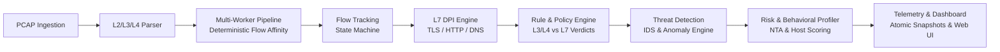
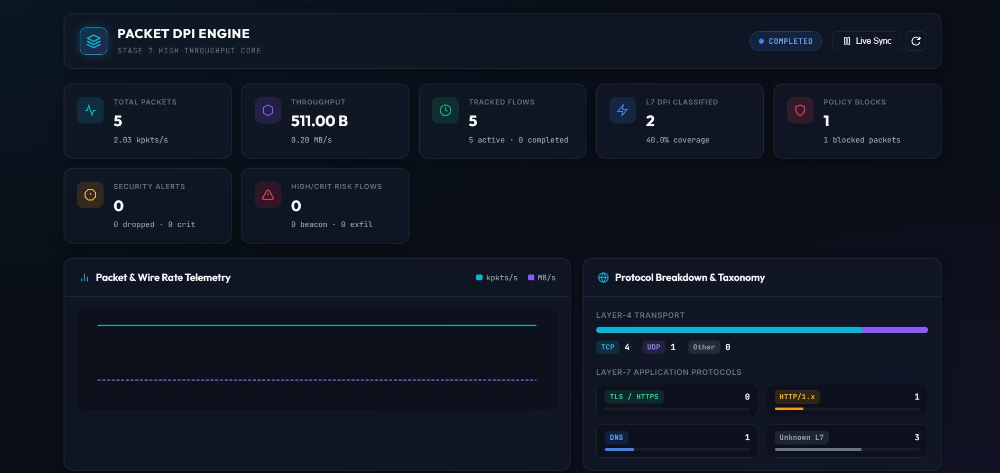
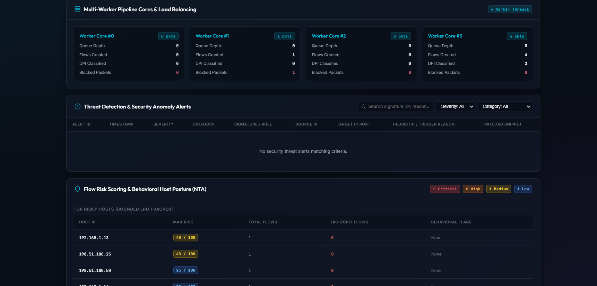
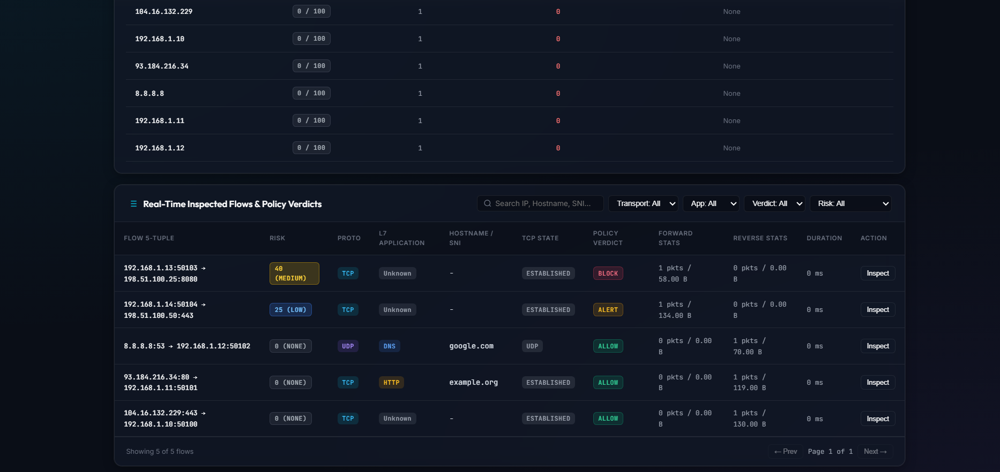

# Packet DPI Engine

A high-performance, modular C++17 Deep Packet Inspection (DPI) engine for PCAP-based network analysis, threat detection, policy evaluation, and behavioral risk profiling.

[](https://github.com/Hafeez-33/packet-dpi-engine/actions/workflows/ci.yml)

---

## What the Project Does

The **Packet DPI Engine** is a multi-threaded network traffic analysis and intrusion-detection platform for offline PCAP workloads. It ingests, decodes, tracks, inspects, and evaluates traffic through a deterministic 9-stage processing pipeline.

- **Packet Ingestion & Parsing**: Parses raw PCAP streams with strict bounds checking across Ethernet II, IPv4/IPv6, TCP, and UDP.
- **Stateful Flow Tracking**: Reconstructs bidirectional conversations with canonical 5-tuple hashing, full TCP lifecycle tracking, and UDP session tracking.
- **Layer-7 Deep Packet Inspection**: Extracts application metadata (TLS SNI, HTTP/1.x Host/URI/Methods, DNS wire format queries) using zero-copy slicing and bounded per-flow reassembly buffers.
- **Policy Enforcement**: Evaluates incoming packets against priority-ordered JSON security rules supporting CIDR subnets, port ranges, and domain wildcards.
- **Threat Detection & Heuristics**: Detects horizontal/vertical port scans, stateful SYN flood attacks, high-entropy DNS tunneling/DGA, and signature-based payload patterns.
- **Behavioral Profiling & Network Traffic Analysis (NTA)**: Computes streaming inter-arrival time (IAT) jitter using online Welford variance, flags periodic C2 beaconing, spots directional data exfiltration, computes normalized composite risk scores (0–100), and maintains bounded host risk profiles.
- **Real-Time Telemetry & Monitoring**: Exports atomic lock-free telemetry snapshots ingested by a FastAPI REST API and visualized through a modern web dashboard.

---

## Architecture Overview

Traffic flows deterministically through the 9-stage modular pipeline:


*High-level architectural pipeline of the Packet DPI Engine across Stages 1–9, illustrating offline PCAP ingestion, bounds-checked parsing, deterministic worker flow affinity, worker-local state machines, threat & behavioral risk engines, and atomic lock-free telemetry snapshots.*



### End-to-End Pipeline Stages

1. **PCAP** &rarr; Streaming zero-copy packet reader handling native and swapped endianness with microsecond/nanosecond precision.
2. **L2/L3/L4 Parser** &rarr; Zero-copy header dissection for Ethernet II, IPv4/IPv6, TCP (options, flags, data offset), and UDP.
3. **Flow Tracking** &rarr; Canonical bidirectional 5-tuple normalization, TCP connection state machine (SYN/ESTABLISHED/FIN/RST), and idle flow expiration.
4. **L7 DPI** &rarr; Bounded reassembly stream buffer per flow, parsing TLS 1.2/1.3 ClientHello (SNI), HTTP/1.x requests, and cyclic-safe DNS queries.
5. **Rule & Policy Engine** &rarr; Two-stage evaluation (L3/L4 fast path vs L7 post-classification) with deterministic priority resolution and Allow/Block/Alert actions.
6. **Multi-Worker Pipeline** &rarr; Multi-threaded producer-consumer architecture using deterministic Murmur3 flow affinity to pin bidirectional flows to worker-local tables without cross-worker mutex contention.
7. **Telemetry & Dashboard** &rarr; Lock-free atomic metrics accumulation, atomic JSON snapshots, and asynchronous FastAPI telemetry service.
8. **Threat Detection** &rarr; Worker-local anomaly detection for port scans, stateful half-open SYN floods, Shannon entropy DNS anomalies, and bounded payload signatures.
9. **Risk / NTA** &rarr; Continuous behavioral profiling calculating streaming inter-arrival time stats, periodic C2 beaconing detection, data exfiltration volume asymmetry, 0–100 composite risk scoring, and LRU host profiles.

---

## Dashboard Preview

The following screenshots demonstrate the web monitoring interface visualizing telemetry, threat alerts, and behavioral risk posture generated from offline PCAP workloads:

### 1. Engine Telemetry & System Overview

*High-level overview showing aggregate packet/byte counters, active flow counts, multi-worker core load distribution, and Layer-4/Layer-7 protocol breakdowns.*

### 2. Threat Detection & Security Alerts

*Security alert stream highlighting horizontal/vertical port scans, stateful SYN flood tracking, DNS tunneling entropy anomalies, and payload signature matches.*

### 3. Behavioral Risk Analysis & Host Profiling

*Network Traffic Analysis (NTA) view featuring composite 0–100 host risk ranking, periodic C2 beaconing detection via streaming IAT jitter, and directional data exfiltration volume asymmetry.*

---

## Key Features Grouped by Stage

| Stage | Module | Key Features |
| :--- | :--- | :--- |
| **Stage 1** | **PCAP Reader** | Streaming file reading, native/byte-swapped endian support, microsecond/nanosecond resolution, truncated packet safety, memory-bounded packet buffers. |
| **Stage 2** | **Protocol Parser** | Zero-copy byte slicing (`std::string_view`), strict bounds-checked parsing for Ethernet II, IPv4 (IHL/options), IPv6, TCP (flags/options/offset), UDP. |
| **Stage 3** | **Flow Tracking** | Canonical symmetric 5-tuple hashing, bidirectional flow state, full TCP state machine tracking, UDP inactivity timers, deterministic LRU cleanup. |
| **Stage 4** | **Layer-7 DPI** | Bounded flow payload reassembly (default 4 KB limit), TLS 1.2/1.3 SNI extraction, HTTP/1.1 request line and Host header parsing, compression-pointer-safe DNS decoder. |
| **Stage 5** | **Rule & Policy Engine** | JSON policy configuration, IPv4/IPv6 CIDR subnets, port ranges, domain wildcards (`*.example.com`), two-stage evaluation lifecycle, deterministic priority resolution. |
| **Stage 6** | **Multi-Worker Pipeline** | Lock-free flow routing, Murmur3 canonical flow hashing, dedicated worker threads with worker-local flow tables (zero cross-worker locks), bounded task ring buffers. |
| **Stage 7** | **Telemetry & Dashboard** | Atomic metrics aggregation, crash-resilient atomic file writing, FastAPI REST API, modern dark-mode responsive monitoring dashboard. |
| **Stage 8** | **Threat Detection & IDS** | Horizontal & vertical port scan trackers, stateful half-open connection SYN flood tracking, Shannon entropy calculation for DNS tunneling/DGA, bounded Aho-Corasick/Boyer-Moore payload signatures. |
| **Stage 9** | **Risk & Behavioral Profiling** | Streaming online Welford variance for packet IAT, low-jitter periodic beaconing heuristic, asymmetric upload/download ratio tracking, 0–100 normalized risk scoring, bounded host LRU cache (4096 entries). |

---

## Architecture & Core Design Principles

- **Modern C++17 Standard**: Built with clean, idiomatic C++17 utilizing `std::string_view`, `std::optional`, `std::variant`, and move semantics.
- **Bounds-Checked Zero-Copy Parsing**: Raw packet buffers are inspected in place without copying packet payloads during Layer 2 through Layer 4 dissection.
- **Deterministic Flow Affinity**: Bidirectional flow packets (forward and reverse) hash to the exact same canonical `FlowKey`, guaranteeing routing to the same dedicated worker thread.
- **Worker-Local State (Shared-Nothing Fast Path)**: Each worker thread maintains its own flow table, threat state, and risk profiler. Packet processing on the fast path requires **zero cross-thread locks**.
- **Bounded Memory Guarantees**: Per-flow DPI reassembly buffers are capped (default 4 KB), worker alert ring buffers have fixed capacities (default 1000 alerts) with dropped counters, and host risk profiles are capped (4096 hosts per worker) with LRU eviction.
- **Online Streaming Statistics**: Inter-arrival time (IAT) mean and variance are computed on the fly using Welford's algorithm ($O(1)$ time, $O(1)$ memory, zero heap allocations on steady-state packets).
- **Atomic Telemetry Snapshots**: Workers update lock-free counters; the telemetry collector aggregates thread metrics into consistent, atomic JSON snapshot files using write-and-rename semantics.

---

## Performance & Benchmarks

All benchmark metrics below were verified on an AMD/Intel 64-bit multi-core architecture running Windows UCRT64 GCC 16.2 (`-O3 -DNDEBUG`):

### 1. Multi-Worker Pipeline Scalability (50,000 Packets across 500 Flows)

| Execution Model | Processing Time | Packet Rate | Throughput | Scalability Factor |
| :--- | :--- | :--- | :--- | :--- |
| **Sequential Baseline** | 71.11 ms | 703.12 kpkts/s | 69.07 MB/s | 1.00x |
| **Worker Pool (1 Core)** | 1509.62 ms | 33.12 kpkts/s | 3.25 MB/s | Baseline Thread |
| **Worker Pool (2 Cores)** | 726.16 ms | 68.85 kpkts/s | 6.76 MB/s | 2.08x vs 1-Worker |
| **Worker Pool (4 Cores)** | 417.31 ms | 119.82 kpkts/s | 11.77 MB/s | 3.62x vs 1-Worker |
| **Worker Pool (8 Cores)** | 269.77 ms | 185.34 kpkts/s | 18.21 MB/s | 5.59x vs 1-Worker |

### 2. Module Microbenchmarks & Overhead

| Benchmark Suite | Metric Measured | Result |
| :--- | :--- | :--- |
| **Welford IAT Calculation** | Microbenchmark throughput | **26.42 Million ops/sec** (37.8 ms / 1M ops) |
| **Shannon Entropy Calculation** | Byte entropy calculation rate | **1.29 Million ops/sec** (773.1 ms / 1M ops) |
| **Telemetry Collector Overhead** | Full pipeline with atomic JSON sync vs without | **18.13%** CPU/runtime overhead |
| **Stage 9 Risk Engine Overhead** | Multi-worker pipeline with Risk Engine ON vs OFF | **2.08%** runtime overhead (141.3 kpkts/s) |

---

## Test Suite & Continuous Integration

The repository enforces strict regression testing and automated continuous integration.

```
CTest Regression Suites (C++ Core):    10/10 Passed (100%)
FastAPI Backend Tests (Python Pytest): 14/14 Passed (100%)
Compiler Warning Flags:                -Wall -Wextra -Wpedantic -Wshadow -Werror (0 warnings)
Continuous Integration (CI):           GitHub Actions (Windows UCRT64 + Python 3.12)
```

### CTest Target Breakdown

1. `CoreVersionTest` &mdash; SemVer semantic version integrity and build metadata.
2. `PcapReaderTest` &mdash; PCAP header parsing, byte-swapping, resolution handling, truncation safety.
3. `ProtocolParserTest` &mdash; Ethernet, IPv4/IPv6, TCP flags/options, UDP bounds checking.
4. `FlowTrackingTest` &mdash; Canonical 5-tuple, TCP state transitions, session expiration.
5. `DpiTest` &mdash; TLS SNI decoding, HTTP/1.1 parsing, cycle-safe DNS queries, buffer overflow abandon.
6. `RuleEngineTest` &mdash; CIDR matching, port ranges, domain wildcards, priority resolution.
7. `WorkerPipelineTest` &mdash; Multi-threaded queue routing, worker affinity, flow isolation.
8. `TelemetryTest` &mdash; Thread-safe counter aggregation, atomic snapshot formatting.
9. `ThreatTest` &mdash; Port scan heuristics, SYN flood counters, DNS entropy calculation, payload signatures.
10. `RiskTest` &mdash; Welford streaming IAT, periodic beaconing detection, exfiltration ratios, host risk ranking.

---

## Web Dashboard

The engine includes a lightweight, responsive real-time security dashboard built with semantic HTML5, Vanilla CSS, and JavaScript, served by FastAPI.

```
+-----------------------------------------------------------------------------------+
|  PACKET DPI ENGINE - REAL-TIME SECURITY & NTA MONITORING DASHBOARD                |
+-----------------------------------------------------------------------------------+
| [Total Packets: 50,000]  [Active Flows: 500]  [Alerts: 142]  [High Risk Hosts: 3] |
+-----------------------------------------------------------------------------------+
|  TRAFFIC & PROTOCOL BREAKDOWN          |  THREAT & ANOMALY ALERTS                 |
|  - TCP / UDP / IPv4 / IPv6 Breakdown   |  - Port Scans Detected                   |
|  - TLS / HTTP / DNS Layer-7 Stats      |  - SYN Flood Half-Open Anomalies         |
|  - Worker Core Queue Depth & Load      |  - DNS Tunneling & High Entropy Alerts   |
+-----------------------------------------------------------------------------------+
|  NETWORK TRAFFIC ANALYSIS (NTA) & BEHAVIORAL RISK POSTURE                         |
|  - Top Risky Host Rankings (0–100 Risk Score, Observed Factors)                   |
|  - C2 Periodic Beaconing Flows (Low Jitter IAT Detection)                         |
|  - Data Exfiltration Outliers (Directional Volume Asymmetry)                      |
+-----------------------------------------------------------------------------------+
|  LIVE FLOW EXPLORER TABLE (Paginated, Searchable, Filter by Protocol/Risk)        |
+-----------------------------------------------------------------------------------+
```


---

## Build Instructions (Windows / MSYS2 UCRT64)

### Prerequisites
- **Toolchain**: MSYS2 with UCRT64 GCC 9+ (`mingw-w64-ucrt-x86_64-gcc`)
- **Build System**: CMake 3.16+ and Ninja or MinGW Makefiles
- **Python**: Python 3.9+ for the telemetry dashboard

### Step-by-Step Compilation

```powershell
# 1. Add MSYS2 UCRT64 toolchain to PowerShell PATH
$env:PATH = "C:\MSYS2\ucrt64\bin;" + $env:PATH

# 2. Configure CMake with strict compiler warnings-as-errors and benchmarks enabled
cmake -G "MinGW Makefiles" -B build -S . `
  -DCMAKE_BUILD_TYPE=Release `
  -DPACKET_DPI_BUILD_TESTS=ON `
  -DPACKET_DPI_ENABLE_WARNINGS_AS_ERRORS=ON `
  -DPACKET_DPI_BUILD_BENCHMARKS=ON

# 3. Build all core libraries, main executable, and test suites
cmake --build build

# 4. Run the CTest test suite
ctest --test-dir build --output-on-failure
```

---

## Run Instructions

### 1. Generate Synthetic Test Traffic
```powershell
# Generate standard and behavioral attack traffic PCAP
python scripts/generate_sample_pcap.py
```

### 2. Execute the C++ DPI Engine
```powershell
./build/dpi_engine.exe `
  --pcap sample_traffic.pcap `
  --rules config/sample_rules.json `
  --workers 4 `
  --telemetry-file telemetry_snapshot.json `
  --max-flows 5000
```

---

## Dashboard & REST API Instructions

### 1. Install Backend Dependencies
```powershell
& "D:\Dentist\New folder\python.exe" -m pip install -r dashboard/backend/requirements.txt pytest
```

### 2. Run Backend Pytest Suite
```powershell
& "D:\Dentist\New folder\python.exe" -m pytest dashboard/tests -v
```

### 3. Launch the Web Monitoring Dashboard
```powershell
& "D:\Dentist\New folder\python.exe" -m uvicorn dashboard.backend.main:app --host 127.0.0.1 --port 8000 --reload
```

Access the dashboard in your browser at `http://127.0.0.1:8000`.

---

## REST API Reference

| Endpoint | Method | Response Description |
| :--- | :--- | :--- |
| `/api/health` | `GET` | Engine status, backend uptime, telemetry file availability |
| `/api/metrics` | `GET` | Full atomic telemetry snapshot |
| `/api/metrics/summary` | `GET` | High-level KPIs (packets, bytes, throughput, active flows, drop counts) |
| `/api/protocols` | `GET` | Layer-4 transport and Layer-7 application breakdown |
| `/api/policies` | `GET` | Rule evaluation stats, block verdicts, alert counts |
| `/api/workers` | `GET` | Per-worker packet count, byte volume, and queue health |
| `/api/flows` | `GET` | Paginated flow records with protocol and risk filtering |
| `/api/flows/{flow_id}` | `GET` | Granular bidirectional statistics and timing for a specific flow |
| `/api/alerts` | `GET` | Security alerts with severity, detector type, and text search |
| `/api/alerts/summary` | `GET` | Aggregated threat alert counters by severity |
| `/api/risks` | `GET` | Host risk profiles and behavioral anomaly breakdown |
| `/api/risks/summary` | `GET` | Summary of risky hosts, beaconing flows, and exfiltration flows |

---

## Repository Structure

```
packet-dpi-engine/
├── .github/workflows/ci.yml    # GitHub Actions dual C++ and Python CI workflow
├── CMakeLists.txt              # Top-level build configuration with -Werror flags
├── include/dpi/                # Modular C++17 public headers
│   ├── common/                 # Byte-order utilities and primitive aliases
│   ├── packet/                 # PCAP file structures and streaming reader
│   ├── protocols/              # L2/L3/L4 headers and ParsedPacket
│   ├── flow/                   # FlowKey, TCP state machine, FlowTable
│   ├── dpi/                    # TLS SNI, HTTP/1.x, DNS wire parsers
│   ├── rules/                  # Security policy and CIDR/Domain matchers
│   ├── pipeline/               # WorkerThread, WorkerPool, FlowRouter
│   ├── telemetry/              # TelemetryCollector, JSON snapshot serializer
│   ├── threat/                 # ThreatEngine, port scan, SYN flood, entropy detectors
│   └── risk/                   # BehavioralProfiler, beaconing, exfiltration, RiskEngine
├── src/                        # C++ implementation files
├── tests/                      # 10 CTest suites covering all stages
├── benchmarks/                 # Pipeline, telemetry, threat, and risk benchmarks
├── config/                     # Sample rule policies and engine configurations
├── scripts/                    # Synthetic PCAP generation scripts
├── dashboard/                  # Full-stack monitoring dashboard
│   ├── backend/                # FastAPI REST application
│   ├── frontend/               # Semantic HTML5, CSS, and Vanilla JS UI
│   └── tests/                  # Pytest test suite for REST backend
└── docs/                       # Architectural documentation (ARCHITECTURE.md)
```

---

## Known Limitations

- **Offline PCAP Analysis**: The engine operates over pre-captured PCAP files via standard file streams rather than live raw socket/AF_PACKET interfaces.
- **Unencrypted Payload Inspection**: Layer-7 DPI parses plaintext protocols (HTTP/1.x, DNS) and unencrypted handshake metadata (TLS ClientHello SNI). Encrypted payload contents are not decrypted.
- **Rule Engine Scope**: Implements 5-tuple and Layer-7 domain matching. Advanced regular expression payload inspection is limited to bounded exact/substring signatures.
- **Single-Host Shared Memory**: Multi-worker pipeline utilizes CPU core parallelism on a single host; distributed clustering across multiple physical nodes is not implemented.

---

## Releases

### `v0.9.0-stage9` &mdash; Flow Risk Scoring & Behavioral Traffic Profiling (NTA)
- Implemented Stage 9 Network Traffic Analysis (NTA) engine with streaming Welford inter-arrival time (IAT) variance.
- Added heuristic C2 periodic beaconing detection with jitter ratio profiling.
- Added directional data exfiltration volume asymmetry scoring.
- Added composite 0–100 risk scoring with bounded LRU host risk profiling.
- Added `/api/risks` and `/api/risks/summary` REST endpoints and dashboard risk visualizations.
- Complete 10/10 CTest and 14/14 Pytest test suites passing with 0 compiler warnings under `-Werror`.

---

## Future Work & Out-of-Scope Items

The following items are outside the scope of the current release and represent potential areas for future exploration:

- **Live Capture Drivers**: Integration with high-speed packet capture frameworks (e.g. DPDK, AF_XDP, PF_RING, or libpcap live interface).
- **Kernel-Level Enforcement**: Offloading policy verdicts to eBPF / XDP for hardware-level packet dropping.
- **QUIC / HTTP/3 Support**: UDP-based QUIC Initial packet decoding and encrypted transport parameter parsing.
- **Machine Learning Classifiers**: Integration of offline-trained ML models for zero-day behavioral clustering and automated anomaly classification.
